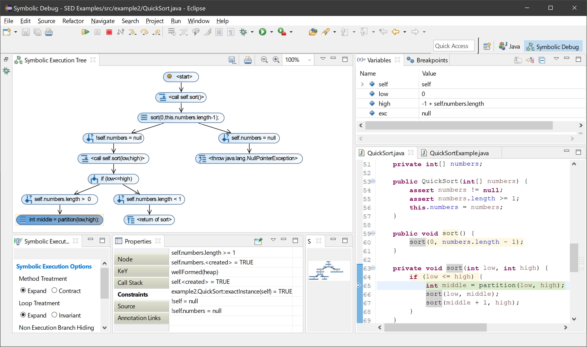

# Example: Symbolic Execution Debugger (SED)

## Installation

Install Eclipse Indigo 3.7 or newer. Note that current versions of Eclipse are not supported. The examples were reproduced using [Eclipse Luna 4.4.0](https://www.eclipse.org/downloads/packages/release/luna/r).

Inside Eclipse, install the KeY plugin following the instructions on the [KeY website](http://i12www.ira.uka.de/key/eclipse/SED/tutorial.html#installation).

## Usage

Open the project in Eclipse and navigate to the [`QuickSort` example](./src/example2/). Right-click the method [`QuickSort.sort()`](./src/example2/QuickSort.java) in the outline or the explorer tree (not in the source code pane) and select <kbd>Debug As</kbd> → <kbd>Symbolic Execution Debugger (SED)</kbd>.

Use the stepping buttons in the toolbar to step through the code.
The *symbolic execution tree* shows the current states of the execution.
If the execution diverges, select one of the branches in the tree to continue stepping.
The source code pane shows the next statement to be executed.
You can watch the current symbolic values of the active program state in the variables pane and all constraints in the constraints pane.

## License Note

The example project, including the [original readme](./sed-Readme.txt), is taken literally from the New Project Template provided by the SED plugin as of version 1.0.0. All rights belong to the original authors of the KeY project. The current source code of the plugin is available on [GitHub](https://github.com/Flunzmas/gym-autokey/tree/master/key/SymbolicExecutionDebugger).
