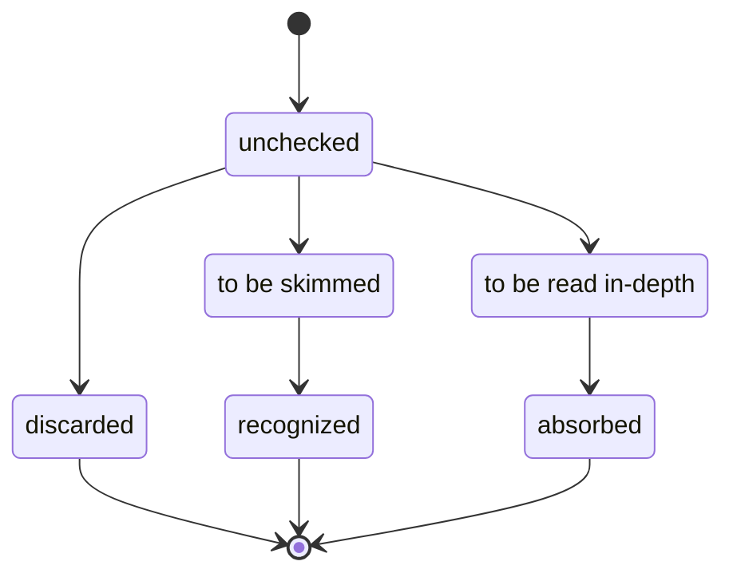

# Literature Research

---

## Template: *Name of source*

Meta:

- **Citation:** *e.g., authors, publication, DOI*
- **Link:** *URL*
- **Inbound references:** *e.g., provided entry points, research on „keyword“, cited by paper #plonk*
- **State:** *e.g., unchecked, discarded, to be skimmed, recognized, to be read in-depth, absorbed*

Findings:

- **Contributions:** *e.g., theory, application, tutorial, implementation, survey, observations, evaluation*

Notes:

- *…*

### Research workflow

#### Recurring entry points

- read literature items that are unchecked/to be skimmed/to be read in-depth
- find further sources
- investigate examples
- define items in glossary

#### Reading workflow (per item)

---

## CUTE

Meta:

- **Citation:** CUTE: A concolic unit testing engine for C
- **Link:** <https://mir.cs.illinois.edu/marinov/publications/SenETAL05CUTE.pdf>
- **Inbound references:** Wikipedia Concolic, Software Testing
- **State:** unchecked

## DART

Meta:

- **Citation:** DART: Directed Automated Random Testing
- **Link:** <https://web.eecs.umich.edu/~weimerw/590/reading/p213-godefroid.pdf>
- **Inbound references:** Wikipedia Concolic, Software Testing
- **State:** unchecked

## KLEE

Meta:

- **Citation:** Cadar, C., Dunbar, D., & Engler, D. R. (2008, December). Klee: unassisted and automatic generation of high-coverage tests for complex systems programs. In *OSDI* (Vol. 8, pp. 209-224).
- **Link:** <https://llvm.org/pubs/2008-12-OSDI-KLEE.pdf>
- **Inbound references:** Software Testing
- **State:** unchecked

## Practical SMT Solving

Meta:

- **Citation:** Wang, J. Practical Satisfiability Modulo Theories (SMT) Solving. Information Security Club at San Jose State University, 2015-04-23.
- **Link:** <https://www.youtube.com/watch?v=iljZWZzFu7k>
- **Inbound references:** (none)
- **State:** recognized

Findings:

- **Contributions:** basic overview of SMT solving approaches and tools

## Program Analysis Lecture

Meta:

- **Citation:** Pradel, M.: Program Analysis. Software Lab, University of Stuttgart.
- **Link:** <https://software-lab.org/teaching/winter2020/pa/#:~:text=L%3A-,symbolic%20and%20concolic%20execution>
- **State:** absorbed

Findings:

- **Contributions:** basic overview of symbolic execution and concolic testing, examples, some discussion, some applications

## SAGE

Meta:

- **Citation:** Godefroid, P., Levin, M. Y., & Molnar, D. (2012). SAGE: Whitebox Fuzzing for Security Testing: SAGE has had a remarkable impact at Microsoft. *Queue*, *10*(1), 20-27.
- **Link:** <https://dl.acm.org/doi/pdf/10.1145/2090147.2094081>
- **Inbound references:** Program Analysis Lecture
- **State:** unchecked

## SMT Learning

Meta:

- **Citation:** Balunović, M. (2021). Learning to Solve SMT Formulas. Theoretical Foundations of SAT/SMT Solving, Simons Institute for the Theory of Computing.
- **Link:** https://simons.berkeley.edu/talks/learning-solve-smt-formulas
- **Inbound references:** (none)
- **State:** skimmed

Findings:

- **Contributions:** basic overview of SMT solving with ex advanced SMT techniques

## Software Testing

Meta:

- **Citation:** Symbolic execution for software testing: three decades later. Cadar, Sen. Communications of the ACM. 2013.
- **Link:** <https://people.eecs.berkeley.edu/~ksen/papers/cacm13.pdf>
- **Inbound references:** provided entry points
- **State:** absorbed

Findings:

- **Contributions:** in-depth overview of theory, approaches, and challenges; collection of implementations; references to surveys (TODO)

## Testing Android Apps

Meta:

- **Citation:** Testing Android Apps Through Symbolic Execution. Mirzaei, Malek, Păsăreanu, Esfahani, Mahmood. ACM SIGSOFT Software Engineering Notes. 2012.
- **Link:** <https://cs.gmu.edu/~smalek/papers/JPF2012.pdf>
- **Inbound references:** provided entry points
- **State:** absorbed

Learnings:

- **Contributions:** solutions for practical symbolic execution for Android apps
- Challenges for symbex with Android apps: different Java VM/bytecode set, path divergence problem (proprietary framework implementation), event-driven frameworks/Hollywood Principle
- Solutions:
  - **stubs/mocks** that model/emulate proprietary Android libraries -> compile to normal JVM bytecode set -> execute it in JPF (Java PathFinder) Symbolic PathFinder (SPF)
  - **connect sub-call graphs** by parsing components from manifest
  - **generate drivers** from sub-call graphs (event sequences to simulate user interaction)
    - root nodes are invocated by system, connections between sub-call graphs by user events
    - CFG (context-free grammar) model for sub-call graphs describes possible event sequences
    - repeat until code coverage threshold is reached
- Implementational remarks
  - could not use reflection in stubs (not supported by JPF) -> reimplement stubs
  - could not use regular hash maps for symbex (path explosion?) -> reimplment hash map

## Wikipedia Concolic

Meta:

- **Link:** https://en.wikipedia.org/wiki/Concolic_testing
- **Inbound references:** Wikipedia symbex
- **State:** to be read in-depth

Findings:

- **Contributions:** basic overview, limitations, list of applications
- TODO: check out tools; maybe read footnotes

## Wikipedia Symbex

Meta:

- **Link:** <https://en.wikipedia.org/wiki/Symbolic_execution>
- **Inbound references:** provided entry points
- **State:** to be read in-depth

Findings:

- **Contributions:** basic overview, limitations, list of applications
- TODO: check out tools; read footnotes
