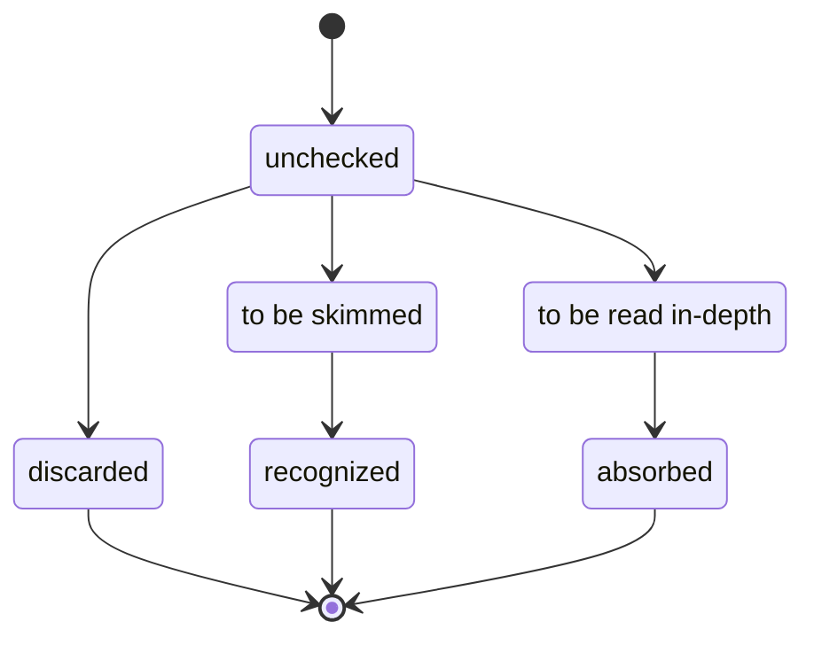

# Literature Research

---

## Template: *Name of source*

Meta:

- **Citation:** *e.g., authors, publication, DOI*
- **Link:** *URL*
- **Inbound references:** *e.g., provided entry points, research on „keyword“, cited by paper #plonk*
- **State:** *e.g., unchecked, discarded, to be skimmed, recognized, to be read in-depth, absorbed*

Findings:

- **Contributions:** *e.g., theory, application, tutorial, implementation, survey, observations, evaluation*

Notes:

- *…*

### Research workflow

#### Recurring entry points

- read literature items that are unchecked/to be skimmed/to be read in-depth
- find further sources
- investigate examples
- define items in glossary

#### Reading workflow (per item)

---

## Advances in Symbolic Execution

Meta:

- **Link:** <https://www.sciencedirect.com/science/article/abs/pii/S0065245818300627>
- **State:** recognized

Findings:

- **Contributions:** trends on symbex implementation approaches and test generation; list of symbex engines

## angr

Meta:

- **Link:** <https://ieeexplore.ieee.org/abstract/document/7546500>

## Awesome Symbolic Execution

Meta:

- **Link:** https://github.com/ksluckow/awesome-symbolic-execution
- **State:** recognized

Findings:

- **Contributions:** collection of papers, lectures, and practical tools on symbex

## BinRec

Meta:

- **Citation:** Altinay, A., Nash, J., Kroes, T., Rajasekaran, P., Zhou, D., Dabrowski, A., ... & Franz, M. (2020, April). BinRec: dynamic binary lifting and recompilation. In *Proceedings of the Fifteenth European Conference on Computer Systems* (pp. 1-16).
- **Link:** <https://download.vusec.net/papers/binrec_eurosys20.pdf>
- **State:** recognized

Findings:

- **Contributions:** usage of symbolic execution for dynamic recompilation

## Chopped Symbolic Execution

Meta:

- **Link:** <https://ieeexplore.ieee.org/document/9794116>

## CrossHair Documentation

Meta:

- **Link:** <https://crosshair.readthedocs.io/en/latest/index.html>
- **State:** recognized

Findings:

- **Contributions:** description of a symbex tool for Python; applications for live contract checking, test generation, and implementation diffing; concept of contractual SemVer

## CUTE

Meta:

- **Citation:** CUTE: A concolic unit testing engine for C
- **Link:** <https://mir.cs.illinois.edu/marinov/publications/SenETAL05CUTE.pdf>
- **Inbound references:** Wikipedia Concolic, Software Testing
- **State:** unchecked

## DART

Meta:

- **Citation:** DART: Directed Automated Random Testing
- **Link:** <https://web.eecs.umich.edu/~weimerw/590/reading/p213-godefroid.pdf>
- **Inbound references:** Wikipedia Concolic, Software Testing
- **State:** unchecked

## Efficient State Merging

Meta:

- **Link:** <https://dslab.epfl.ch/pubs/stateMerging.pdf>

## EGT

Meta:

- **Link:** <https://www.doc.ic.ac.uk/~cristic/papers/egt-spin-05.pdf>

## jCute

Meta:

- **Link:** <https://link.springer.com/chapter/10.1007/978-3-540-70889-6_13>

## KLEE

Meta:

- **Citation:** Cadar, C., Dunbar, D., & Engler, D. R. (2008, December). Klee: unassisted and automatic generation of high-coverage tests for complex systems programs. In *OSDI* (Vol. 8, pp. 209-224).
- **Link:** <https://llvm.org/pubs/2008-12-OSDI-KLEE.pdf>
- **Inbound references:** Software Testing
- **State:** absorbed

Findings:

- **Contributions:** solution for bug detection, crash test generation, testing tool equivalence, and syscall fuzz testing; dealing with environments, bit-level accuracy, many optimization details; evaluation of impact for selected libraries
- used to detect many tests in popular OSS such as linux coreutils and write regression tests
- operates on LLVM bytecode (bit-level accurate), uses constraint solver STP
- operation results are stored as symbolic expressions; clone (execution) state on symbolic jump conditions; implicit branches for dangerous operation (e.g., zero divison, dereference)
- optimizations:
  - distinct STP array for each object (less pressure on solver); implicit branch for symbolic pointers (seldom used)
  - compact state representation: immutable map for heap with copy-on-write objects
  - query optimizations: simplify expressions; simplify constraint sets; concretize values eagerly; split up independent constraints (for different parts of memory) for faster checking
  - caches for subsets/supersets of constraint sets
  - state scheduling: random path selection from binary tree of active states (favors shorter paths, avoids starvation from infinite forks), coverage-optimized search by weighting states with multiple heuristics alternately; time slicing per state
- environment models (filesystem, networking, environment variables, …)
  - small models to emulate syscalls, independent of klee‘s internals, extensible by user
  - filesystem: forward concrete file accesses to real fs (doesn‘t this require isolation?), emulate others
  - choose appropriate abstraction level for model (library vs syscall, performance vs implementational complexity)
  - (optionally) simulate environment-related syscall failures (e.g., hardware failures)
- generate regression tests for each failure
  - no assertions/test oracle, just for reproduction of crashes through developer
    - but developer can provide test oracle (reference implementation) and have klee compare both symbolically
  - run with normal binaries in replay driver that provides defined environment behavior
  - rerun each generated test to assure it fails
- evaluation:
  - 90% code coverage for coreutils
  - in comparison, random testing does not detect when everything is covered

## Literature Overview

Meta:

- **Citation:** Reid, A. Related Work.
- **Link:** <https://alastairreid.github.io/RelatedWork>
- **State:** to be skimmed

Findings:

- **Contributions:** brief overview of related work on symbex

## Mayhem

Meta:

- **Link:** <https://ieeexplore.ieee.org/abstract/document/6234425>

## MergePoint

- **Citation:** Avgerinos, T., Rebert, A., Cha, S. K., & Brumley, D. (2014, May). Enhancing symbolic execution with veritesting. In *Proceedings of the 36th International Conference on Software Engineering* (pp. 1083-1094).
- **Link:** <https://users.ece.cmu.edu/~aavgerin/papers/veritesting-icse-2014.pdf>
- **State:** absorbed

Findings:

- **Contributions:** static symbolic execution (SSE) through veritesting; evaluation of impact for selected binaries

## Microsoft IntelliTest

Meta:

- **Citation:** Hogenson, G., Warren, G., Sherer, T., et al. Microsoft Intellitest. In *Visual Studio (Windows). Microsoft Learn.* 2022.
- **Link:** <https://learn.microsoft.com/en-us/visualstudio/test/intellitest-manual>
- **Inbound references:** (none)
- **State:** absorbed

Findings:

- **Contributions:** exhaustive documentation of Microsoft IntelliTest tooling; brief summary of implementation and limitations

## PEX

Meta:

- **Citation:** Tillmann, N., & Halleux, J. D. (2008, April). Pex–white box test generation for. net. In *International conference on tests and proofs* (pp. 134-153). Springer, Berlin, Heidelberg.
- **Link:** <https://www.microsoft.com/en-us/research/wp-content/uploads/2008/04/fulltext.pdf>
- **Inbound references:** (none)
- **State:** to be skimmed

Findings:

- **Contributions:** description of PEX framework; case study

## PEX to Code Digger

Meta:

- **Citation:** Tillmann, N., De Halleux, J., & Xie, T. (2014, September). Transferring an automated test generation tool to practice: From Pex to Fakes and Code Digger. In *Proceedings of the 29th ACM/IEEE international conference on Automated software engineering* (pp. 385-396).
- **Link:** <https://dl.acm.org/doi/pdf/10.1145/2642937.2642941>
- **Inbound references:** (none)
- **State:** to be skimmed

Findings:

- **Contributions:** evolution of PEX to industry product; empirical observations; tool impact

## Practical SMT Solving

Meta:

- **Citation:** Wang, J. Practical Satisfiability Modulo Theories (SMT) Solving. Information Security Club at San Jose State University, 2015-04-23.
- **Link:** <https://www.youtube.com/watch?v=iljZWZzFu7k>
- **Inbound references:** (none)
- **State:** recognized

Findings:

- **Contributions:** basic overview of SMT solving approaches and tools

## Program Analysis Lecture

Meta:

- **Citation:** Pradel, M.: Program Analysis. Software Lab, University of Stuttgart.
- **Link:** <https://software-lab.org/teaching/winter2020/pa/#:~:text=L%3A-,symbolic%20and%20concolic%20execution>
- **State:** absorbed

Findings:

- **Contributions:** basic overview of symbolic execution and concolic testing, examples, some discussion, some applications

## S2E

Meta:

- **Link:** <https://dl.acm.org/doi/abs/10.1145/1961296.1950396>

## SAGE Impact

Meta:

- **Citation:** Godefroid, P., Levin, M. Y., & Molnar, D. (2012). SAGE: Whitebox Fuzzing for Security Testing: SAGE has had a remarkable impact at Microsoft. *Queue*, *10*(1), 20-27.
- **Link:** <https://dl.acm.org/doi/pdf/10.1145/2090147.2094081>
- **Inbound references:** Program Analysis Lecture
- **State:** absorbed

Findings:

- **Contributions:** binary-based solution, some optimizations for concolic execution, performance and impact evaluation at Microsoft
- SAGE = Scalable Automated Guided Execution
- concolic testing for x86 binaries
  - pro: considers compiler-caused behavioral changes („what you fuzz is what you ship“)
- test generation: record trace for all environment events during symbolic execution, reapply events during test execution
- optimizations:
  - scheduling
    - generational search (directed search instead BFS or DFS): negate constraints one-by-one
    - rank constraint sets by new code coverage (in the first run, execute unsymbolically to measure code coverage only)
    - supports parallel/distributed execution
  - symbolic-expression caching, constraint simplification (e.g., for unrelated, redundant, or logically implied constraints)
- evaluation:
  - performance: 8h for an ANI parser (2007, 2 cores)
  - impact at Microsoft: responsible for finding 1/3 of bugs in Windows 7, run 24/7 – in total more than 300 machine-years in 4 years, currently on more than 200 machines each day

## SAGE Implementation

Meta:

- **Citation:** Godefroid, P., Levin, M. Y., & Molnar, D. A. (2008, February). Automated whitebox fuzz testing. In *NDSS* (Vol. 8, pp. 151-166).
- **Link:** <https://www.cs.purdue.edu/homes/xyzhang/fall07/Papers/fuzz.pdf>
- **State:** unchecked

## Search Strategies

- **Citation:** Liu, Y., Zhou, X., & Gong, W. W. (2017). A survey of search strategies in the dynamic symbolic execution. In *ITM Web of Conferences* (Vol. 12, p. 03025). EDP Sciences.

## Search Strategies DSE

Meta:

- **Link:** <https://www.sciencedirect.com/science/article/abs/pii/S0920548919300066?via%3Dihub>

Findings:

- **Contributions:** comprehensive survey of search strategies; classification; evaluation

## SFU Slides

Meta:

- **Link:** <https://www2.cs.sfu.ca/~wsumner/teaching/473/14-symbolic-execution.pdf>
- **State:** recognized

Findings:

- **Contributions:** brief overview of symbex approach, implementations, challenges, applications, and some tools

## SMT Learning

Meta:

- **Citation:** Balunović, M. (2021). Learning to Solve SMT Formulas. Theoretical Foundations of SAT/SMT Solving, Simons Institute for the Theory of Computing.
- **Link:** https://simons.berkeley.edu/talks/learning-solve-smt-formulas
- **Inbound references:** (none)
- **State:** recognized

Findings:

- **Contributions:** basic overview of SMT solving with ex advanced SMT techniques

## Software Testing Preliminary

Meta:

- **Citation:** Cadar, C., Godefroid, P., Khurshid, S., Păsăreanu, C. S., Sen, K., Tillmann, N., & Visser, W. (2011, May). Symbolic execution for software testing in practice: preliminary assessment. In *Proceedings of the 33rd International Conference on Software Engineering* (pp. 1066-1071).
- **Link:** <https://www.doc.ic.ac.uk/~cristic/papers/symex-icse-impact-11.pdf>
- **Inbound references:** (none)
- **State:** absorbed

Findings:

- **Contributions:** short overview of theory, some implementation strategies, and some implementations

## Software Testing

Meta:

- **Citation:** Symbolic execution for software testing: three decades later. Cadar, Sen. Communications of the ACM. 2013.
- **Link:** <https://people.eecs.berkeley.edu/~ksen/papers/cacm13.pdf>
- **Inbound references:** provided entry points
- **State:** absorbed

Findings:

- **Contributions:** in-depth overview of theory, approaches, and challenges; collection of implementations; references to surveys (TODO)

## Software and Security Testing

Meta:

- **Citation:** Pham, T. (2022): Software and Security Testing. University of Melbourne.
- **Link:** <https://swen90006.github.io/notes/Symbolic-Execution.html>
- **State:** skimmed

Findings:

- **Contributions:** basic overview of symbex approach, implementations, challenges, applications, educational examples

## Symbex

Meta:

- **Citation:** King, J. C. (1976). Symbolic execution and program testing. *Communications of the ACM*, *19*(7), 385-394.
- **URL:** <https://dl.acm.org/doi/pdf/10.1145/360248.360252>
- **State:** unchecked

Findings:

- **Contributions:** *the* original paper on symbex

## Symbex Techniques Survey

Meta:

- **Link:** <https://arxiv.org/pdf/1610.00502.pdf>
- **Summary:** <https://alastairreid.github.io/RelatedWork/papers/baldoni:compsurv:2018/>
- **State:** absorbed

Findings:

- **Contributions:** detailed overview of implementation approaches, challenges, and their solution; overview of some applications in the online appendix

## Symbex Tools Survey

Meta:

- **Citation:** Duraibi, S., Alashjaee, A. M., & Song, J. (2019). A Survey of Symbolic Execution Tools. *International Journal of Computer Science and Security (IJCSS)*, *13*(6), 244-255.
- **Link:** <http://www.cscjournals.org/manuscript/Journals/IJCSS/Volume13/Issue6/IJCSS-1519.pdf>
- **State:** discarded

Findings:

- low-quality paper!
- **Contributions:** brief overview of academic symbex tools

## Symbolic Execution Debugger

Meta:

- **Citation:** Hentschel, M., Bubel, R., & Hähnle, R. (2019). The Symbolic Execution Debugger (SED): a platform for interactive symbolic execution, debugging, verification and more. *International Journal on Software Tools for Technology Transfer*, *21*(5), 485-513.
- **Link:** <https://www.researchgate.net/journal/International-Journal-on-Software-Tools-for-Technology-Transfer-1433-2787/publication/323544859_The_Symbolic_Execution_Debugger_SED_a_platform_for_interactive_symbolic_execution_debugging_verification_and_more/links/5fb9273a299bf104cf6710b3/The-Symbolic-Execution-Debugger-SED-a-platform-for-interactive-symbolic-execution-debugging-verification-and-more.pdf>
- **State:** to be checked

Findings:

- **Contributions:** interactive symbolic execution

## Symbolic Execution Timelines

Meta:

- **Link:** <https://github.com/enzet/symbolic-execution>
- **State:** recognized

Findings:

- **Contributions:** overview, history, and organizational connections of symbolic execution engines and solvers

## Symbolic Evaluation

Meta:

- **Citation:** Cheatham, T. E., Holloway, G. H., & Townley, J. A. (1979). Symbolic evaluation and the analysis of programs. *IEEE Transactions on Software Engineering*, (4), 402-417.
- **Inbound references:** (none)
- **State:** recognized

Findings:

- **Contributions:** concept related to static symbex

## SymTuner

Meta:

- **URL:** <https://ieeexplore.ieee.org/document/9794116>
- **State:** recognized

## Testing Android Apps

Meta:

- **Citation:** Testing Android Apps Through Symbolic Execution. Mirzaei, Malek, Păsăreanu, Esfahani, Mahmood. ACM SIGSOFT Software Engineering Notes. 2012.
- **Link:** <https://cs.gmu.edu/~smalek/papers/JPF2012.pdf>
- **Inbound references:** provided entry points
- **State:** absorbed

Learnings:

- **Contributions:** solutions for practical symbolic execution for Android apps
- Challenges for symbex with Android apps: different Java VM/bytecode set, path divergence problem (proprietary framework implementation), event-driven frameworks/Hollywood Principle
- Solutions:
  - **stubs/mocks** that model/emulate proprietary Android libraries -> compile to normal JVM bytecode set -> execute it in JPF (Java PathFinder) Symbolic PathFinder (SPF)
  - **connect sub-call graphs** by parsing components from manifest
  - **generate drivers** from sub-call graphs (event sequences to simulate user interaction)
    - root nodes are invocated by system, connections between sub-call graphs by user events
    - CFG (context-free grammar) model for sub-call graphs describes possible event sequences
    - repeat until code coverage threshold is reached
- Implementational remarks
  - could not use reflection in stubs (not supported by JPF) -> reimplement stubs
  - could not use regular hash maps for symbex (path explosion?) -> reimplement hash map

## Wikipedia Concolic

Meta:

- **Link:** https://en.wikipedia.org/wiki/Concolic_testing
- **Inbound references:** Wikipedia symbex
- **State:** to be read in-depth

Findings:

- **Contributions:** basic overview, limitations, list of applications
- TODO: check out tools; maybe read footnotes

## Wikipedia Symbex

Meta:

- **Link:** <https://en.wikipedia.org/wiki/Symbolic_execution>
- **Inbound references:** provided entry points
- **State:** to be read in-depth

Findings:

- **Contributions:** basic overview, limitations, list of applications
- TODO: check out tools; read footnotes
