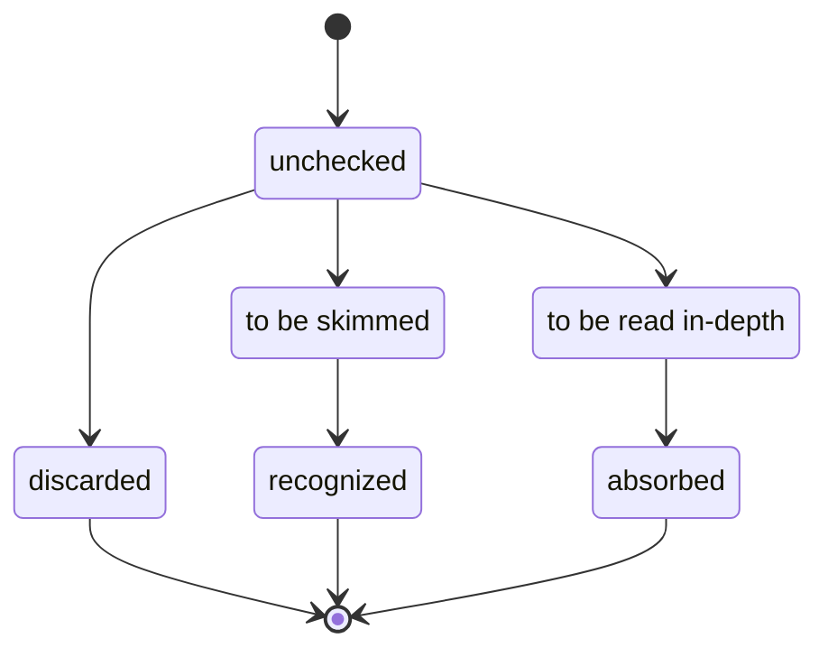

# Literature Research

---

## Template: *Name of source*

Meta:

- **Citation:** *e.g., authors, publication, DOI*
- **Link:** *URL*
- **Inbound references:** *e.g., provided entry points, research on „keyword“, cited by paper #plonk*
- **State:** *e.g., unchecked, discarded, to be skimmed, recognized, to be read in-depth, absorbed*

Findings:

- **Contributions:** *e.g., theory, application, tutorial, implementation, survey, observations, evaluation*

Notes:

- *…*

### Research workflow

---

## Testing Android Apps

Meta:

- **Citation:** Testing Android Apps Through Symbolic Execution. Mirzaei, Malek, Păsăreanu, Esfahani, Mahmood. ACM SIGSOFT Software Engineering Notes. 2012.
- **Link:** <https://cs.gmu.edu/~smalek/papers/JPF2012.pdf>
- **Inbound references:** provided entry points
- **State:** unchecked

## Software Testing

Meta:

- **Citation:** Symbolic execution for software testing: three decades later. Cadar, Sen. Communications of the ACM. 2013.
- **Link:** <https://people.eecs.berkeley.edu/~ksen/papers/cacm13.pdf>
- **Inbound references:** provided entry points
- **State:** unchecked

## Wikipedia

Meta:

- **Link:** <https://en.wikipedia.org/wiki/Symbolic_execution>
- **Inbound references:** provided entry points
- **State:** to be read in-depth

